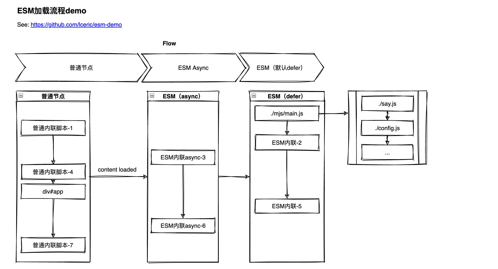

# ESM Demo

[esm-demo](https://lceric.github.io/esm-demo/)



## code
**index.html**

```html
<!DOCTYPE html>
<html lang="en">
  <head></head>
  <body>
    <script src="./mjs/main.js" type="module"></script>

    <script>
      console.log('1--内联普通脚本this', this)
      console.log('1--内联普通脚本初始获取dom', document.querySelector('#app'))
    </script>
    <script type="module">
      console.log('2--内联模块脚本的this', this)
      console.log('2--内联模块脚本初始获取dom', document.querySelector('#app'))
    </script>
    <script type="module" async>
      console.log(
        '3--内联async模块脚本初始获取dom',
        document.querySelector('#app')
      )
    </script>
    <script>
      console.log('4--内联普通脚本初始获取dom', document.querySelector('#app'))
    </script>

    <div id="app">
      <button class="print-config">获取当前config</button>
    </div>

    <script type="module">
      console.log('5--内联模块脚本初始获取dom', document.querySelector('#app'))
    </script>
    <script type="module" async>
      console.log(
        '6--内联async模块脚本初始获取dom',
        document.querySelector('#app')
      )
    </script>
    <script>
      console.log('7--内联普通脚本初始获取dom', document.querySelector('#app'))
    </script>
  </body>
</html>
```


**./mjs/main.js**

```js
// main.js
import * as say from './say.js'
import config from './config.js'
// ...
```

See more [./mjs/main.js](./mjs/main.js)
